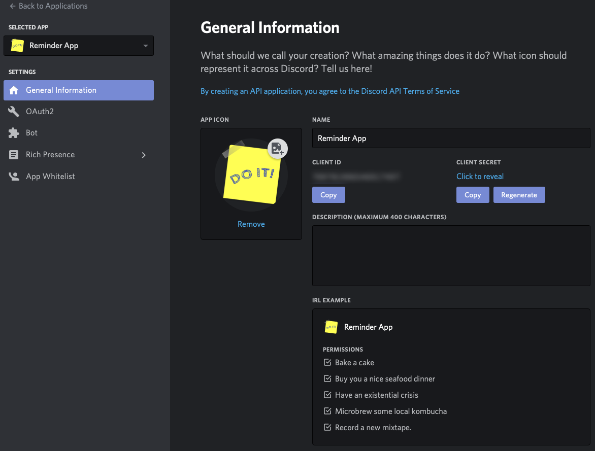
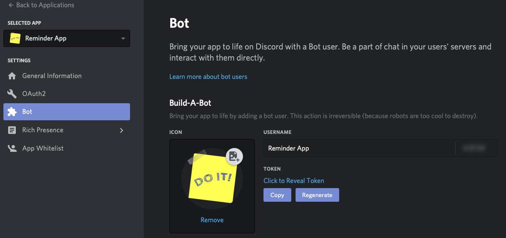
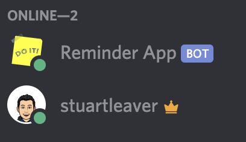
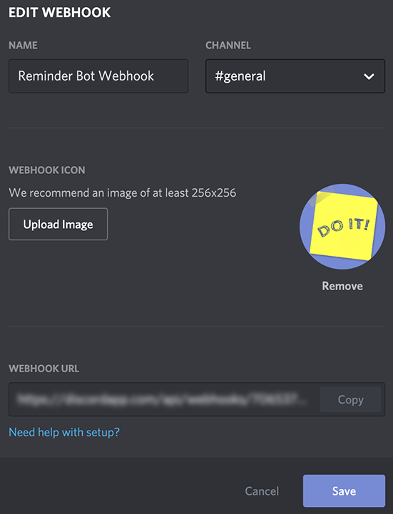
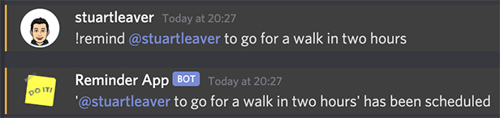
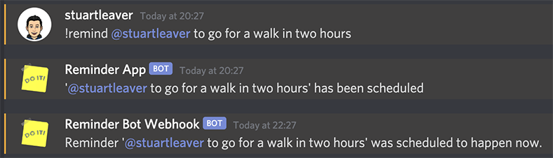

# Reminders Discord Bot and Azure Durable Functions
A Discord Bot to create reminders with the Durable Functions extension in Azure Functions.

## What are Azure Durable Functions?
Azure Durable Functions is an extension of Azure Functions and it lets you use state in a serverless environment. More information can be found in the [documentation](https://docs.microsoft.com/en-us/azure/azure-functions/durable/durable-functions-overview?tabs=csharp)", but what what are we going to use state for?

In this sample, state will be used to create a Discord Reminders Bot with a bit of natural language processing thrown in as well. In a Discord Server where the Bot is, someone could type "!remind @stuartleaver to go for a walk in two hours". That reminder will get sent to a Durable Function and after being parsed by [Chrono](https://github.com/wanasit/chrono) and [Moment.js](https://momentjs.com), will orchestrate a timer and an activity function. First, the timer will be created:

`yield context.df.createTimer(new Date(reminderDueAt));` - `reminderDueAt` being the time from `Chrono`

That timer will hold it's state (for up to seven days), even within a serverless environment, and then will call the `sendToDiscord` activity when the time passes:

`return yield context.df.callActivity("sendToDiscord", data);`

A call will then we made back to a webhook in the Discord Server to post the reminder.

The statefulness is stored within a Storage Account. However, as mentioned above, this does have limitations because a timer is then limited to 7 days. This is highlighted in the [documentation](https://docs.microsoft.com/en-us/azure/azure-functions/durable/durable-functions-timers?tabs=csharp) for Timers in Durable Functions:

>* Durable timers are currently limited to 7 days. If longer delays are needed, they can be simulated using the timer APIs in a while loop.
* Always use `CurrentUtcDateTime` instead of `DateTime.UtcNow` in .NET or `currentUtcDateTime` instead of `Date.now` or `Date.UTC` in JavaScript when computing the fire time for durable timers. For more information, see the orchestrator function code constraints article.

So while a simple sample, it introduces using Durable Functions to hold state state within a serverless environment. The primary use is to simplify complex, stateful coordination in serverless applications and here is a list of typical application patterns:

* [Function chaining](https://docs.microsoft.com/en-us/azure/azure-functions/durable/durable-functions-overview?tabs=csharp#chaining)
* [Fan-out/fan-in](https://docs.microsoft.com/en-us/azure/azure-functions/durable/durable-functions-overview?tabs=csharp#fan-in-out)
* [Async HTTP APIs](https://docs.microsoft.com/en-us/azure/azure-functions/durable/durable-functions-overview?tabs=csharp#async-http)
* [Monitoring](https://docs.microsoft.com/en-us/azure/azure-functions/durable/durable-functions-overview?tabs=csharp#monitoring)
* [Human interaction](https://docs.microsoft.com/en-us/azure/azure-functions/durable/durable-functions-overview?tabs=csharp#human)
* [Aggregator (stateful entities)](https://docs.microsoft.com/en-us/azure/azure-functions/durable/durable-functions-overview?tabs=csharp#aggregator)

The following sections will go into deploying the resources in Azure and setting up the Discord Bot. This won't go into details of the Bot as the main point here is the Durable Functions. Some assumptions have been made on hosting, and so some changes may be needed if hosted in a different way.

## Quick Deploy to Azure
[](https://portal.azure.com/#create/Microsoft.Template/uri/https%3A%2F%2Fraw.githubusercontent.com%2Fstuartleaver%2Fdiscord-reminders-azure-functions%2Fmaster%2Fazuredeploy.json)

This template creates the resources required.

Below are the parameters which can be user configured in the parameters file including:

- **Application Name:** Enter the name you wish to call the application. This name will be used as a base for the resources which will get created.

Ideally this would be part of the Action to deploy the code, and it was at one point. However, I decided to split it out to make Deploying to the Function App a bit easier. The function's could have been deployed via RBAC, but that has been deprecated in favour of using the Publish Profile. So a compromise was made. I will probably have a go at getting it fully automated, but feel free to submit suggestions or have a go yourself at getting it fully automated.

## Setting up the Deployment Secrets
Although an Action is used to deploy the code and creates the required application settings and Config Var's etc. the Secrets need setting up in the repo. It is assumed that you will be deploying to Heroku and so if you don't already have one, you will need to create a free [Heroku account](https://www.heroku.com).

The following table shows the Secrets that need setting up, and details on where the values can be found are contained in the various sections:

| Key                                | Description |
| :-------------                     | :------------- |
| AZURE_CREDENTIALS                  | The JSON role assignment credentials of a service principle. See below for instructions. |
| AZURE_FUNCTION_APP_ENDPOINT        | The URL of your Function App created by the ARM Template without a trailing backslash e.g. https://{name-of-function-app}.azurewebsites.net |
| AZURE_FUNCTION_APP_MASTER_KEY      | The master key of the Function App created by the ARM Template |
| AZURE_FUNCTION_APP_NAME            | The name of the Function App created by the ARM Template |
| AZURE_FUNCTION_APP_PUBLISH_PROFILE | The Publish Profile of the Function App created by the ARM Template in XML. Instruction on how to find this are below. |
| AZURE_RESOURCE_GROUP_NAME          | The name of the Resource Group containing the Function App created by the ARM Template. |
| DISCORD_TOKEN                      | The Client ID of the created Discord Bot. |
| DISCORD_WEBHOOK                    | The URL of the Discord Webhook. |
| HEROKU_API_KEY                     | Your Heroku API key which is available in your Account Settings. |
| HEROKU_APP_NAME_DISCORD_BOT        | The name you wish to use for the Heroku app hosting the Discord Bot. |
| HEROKU_EMAIL_ADDRESS               | The email address you used for your Heroku account. |

If deploying differently, you will need to setup the variable according to where you are deploying. If running locally, you will need to create a `.env` file for the Discord Bot and a `local.settings.json` file for the Functions.

### Configure Azure Credentials as GitHub Secret
```bash  

   az ad sp create-for-rbac --name "myApp" --role contributor \
                            --scopes /subscriptions/{subscription-id}/resourceGroups/{resource-group} \
                            --sdk-auth

  # Replace {subscription-id}, {resource-group} with the subscription, resource group details

  # The command should output a JSON object similar to this:

  {
    "clientId": "<GUID>",
    "clientSecret": "<GUID>",
    "subscriptionId": "<GUID>",
    "tenantId": "<GUID>",
    (...)
  }

```

### Azure Function App Publish Profile
1. In Azure portal, go to your function app.

2. Click Get publish profile and download .PublishSettings file.

3. Open the .PublishSettings file and copy the content.


## Discord Bot & Webhook Setup
Setting up a Discord Bot is not just a case of building and deploying the code. There are some manual steps needed to use this sample.

There are two steps to this process:
1. Setting up a bot application
2. Adding your bot to servers
3. Setting up the webhook
4. Connecting it all together

[Discord.js Guide](https://discordjs.guide) has some great documentation on this so the following is just some additional information in the context of this sample.

### Setting up a bot application
Setup your application as per the "[Setting up a bot application](https://discordjs.guide/preparations/setting-up-a-bot-application.html)" guide. Once created, you should see a page like this:



Then once you have created the Bot, you should see something like this:



Then it just needs adding to a server.

### Adding your bot to servers
Again, you can follow the "[Adding your bot to servers](https://discordjs.guide/preparations/adding-your-bot-to-servers.html)" for this step.

Once added, you should see something similar to this:



You of course will only see the Bot online if you have have added your Client Secret as `DISCORD_TOKEN` to either your GitHub Secrets if deploying through GitHub Actions or where ever needed depending on how you are running the Bot. For example, a `.env` file if running the code locally.

### Setting up the webhook
You can create webhooks directly through the discord client, go to Server Settings, you will see a `Webhooks` tab.


Once you are there, click on the `Create Webhook` button on the top right. This will create a webhook, from here you can edit the channel, the name, and the avatar. Copy the link, the first part is the id, and the second is the token, you will need this later.



# Usage
When everything has been setup, it's time to schedule a reminder. To schedule a reminder, use the `!remind` command with who and what you would like to remind:

`!remind @stuartleaver to go for a walk in two hours`

You should then see your message followed by one from the Bot in the channel:



When the time comes, you should see your reminder being posted via the webhook:



If you take a look at the times, you will see that the message from the webhook, is two hours after the reminder.

## License
[MIT](LICENSE)
